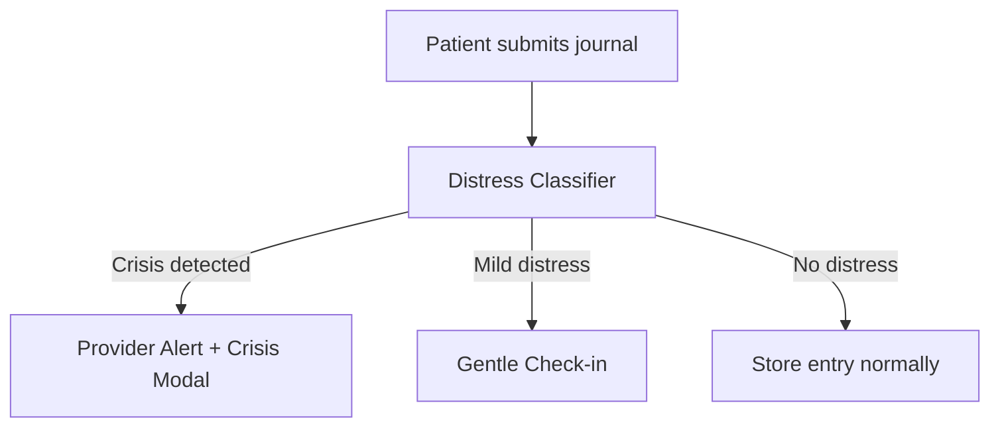

# Next Steps — DWA Documentation Setup

## What's Done

✅ Nextra documentation site created at `/Volumes/ext-data/github/digitalwellness-academy-docs/`  
✅ Multi-project structure (Platform, Distress Classifier, Forum, Infrastructure, Operations)  
✅ Platform capability inventory migrated from your exhaustive audit  
✅ Docker configuration for Dokploy deployment  
✅ Theme configured with DWA branding (indigo colors, logo, meta tags)  
✅ Navigation structure set up  
✅ Homepage created with overview of all services  

## Immediate Actions

### 1. Test Locally (2 minutes)

```bash
cd /Volumes/ext-data/github/digitalwellness-academy-docs
npm run dev
```

Open http://localhost:3000 — you should see the docs site with:
- Homepage overview
- Platform section with complete capability inventory
- Navigation for all services (Platform, Distress Classifier, Forum, Infrastructure, Operations)

### 2. Initialize Git Repository (if separate repo)

**Option A: Separate Docs Repo** (Recommended)

```bash
cd /Volumes/ext-data/github/digitalwellness-academy-docs
git remote add origin https://github.com/SoloFrameHub/digitalwellness-academy-docs.git
git add .
git commit -m "Initial docs site setup with Nextra"
git push -u origin main
```

**Option B: Monorepo** (Keep docs with main platform)

```bash
# Move docs into main repo
mv /Volumes/ext-data/github/digitalwellness-academy-docs /Volumes/ext-data/github/mental-health-education-platform-main/docs-site

cd /Volumes/ext-data/github/mental-health-education-platform-main
git add docs-site/
git commit -m "Add Nextra documentation site"
git push origin main
```

### 3. Deploy to Dokploy (10 minutes)

1. **Log into Dokploy** (https://46.202.88.248:3000 or your Dokploy URL)

2. **Create New Application:**
   - Click "New Application"
   - Name: `dwa-docs`
   - Type: Docker (Dockerfile)
   - Repository: `https://github.com/SoloFrameHub/digitalwellness-academy-docs` (or path to monorepo)
   - Branch: `main`
   - Context Path: `/` (or `/docs-site/` if monorepo)
   - Dockerfile Path: `./Dockerfile`
   - Port: 3000

3. **Configure Domain:**
   - In app settings → Domains
   - Add domain: `docs.digitalwellness.academy`
   - Enable HTTPS (Let's Encrypt)
   - Save

4. **Deploy:**
   - Click "Deploy"
   - Monitor build logs
   - Should complete in 2-3 minutes

5. **Verify:**
   - Visit https://docs.digitalwellness.academy
   - Check all pages load
   - Test search functionality

### 4. Set Up DNS (5 minutes)

If not already configured:

1. Log into your DNS provider (Hostinger, Cloudflare, etc.)
2. Add A record:
   - Name: `docs`
   - Type: A
   - Value: `46.202.88.248` (your VPS IP)
   - TTL: 3600 (1 hour)
3. Wait for DNS propagation (usually 5-15 minutes)
4. Test: `dig docs.digitalwellness.academy` should return VPS IP

## Content To Add

The structure is in place. Now populate the remaining sections:

### Platform Section (Priority 1)

**API Reference** (`/pages/platform/api/`)
- [ ] Overview (API architecture, auth, rate limiting)
- [ ] Authentication endpoints (/api/auth/*)
- [ ] Onboarding endpoints (/api/onboarding/*)
- [ ] Academy endpoints (/api/academy/*)
- [ ] Provider endpoints (/api/provider/*)
- [ ] Admin endpoints (/api/admin/*)
- [ ] AI endpoints (/api/ai/*)
- [ ] Forum endpoints (/api/forum/*)

**Architecture** (`/pages/platform/architecture/`)
- [ ] System design diagram (Mermaid)
- [ ] Database schema (auto-generated from Drizzle)
- [ ] Authentication flow
- [ ] Multi-tenant architecture
- [ ] Two-school model architecture
- [ ] Distress classifier integration
- [ ] Forum integration architecture

**Guides** (`/pages/platform/guides/`)
- [ ] Provider Portal Guide (how to use provider dashboard, assign courses, respond to alerts)
- [ ] Admin Guide (how to verify providers, manage platform)
- [ ] Developer Guide (how to add features, coding standards, where code lives)
- [ ] Content Author Guide (how to create courses, lessons, quizzes)

### Distress Classifier Section (Priority 2)

**Architecture** (`/pages/distress-classifier/architecture/`)
- [ ] DistilBERT model details (fine-tuning process, training data, accuracy)
- [ ] Zero-knowledge architecture (privacy guarantees)
- [ ] Classification methodology (confidence thresholds, action triggers)
- [ ] Performance characteristics (latency, throughput, resource usage)

**API** (`/pages/distress-classifier/api/`)
- [ ] POST /classify endpoint (parameters, response format, examples)
- [ ] GET /health endpoint (health checks)
- [ ] Error handling and fallback behavior

**Deployment** (`/pages/distress-classifier/deployment/`)
- [ ] Docker setup (Dockerfile walkthrough)
- [ ] Dokploy deployment (how it's deployed alongside main app)
- [ ] Environment variables
- [ ] Monitoring and logs

### Forum Section (Priority 3)

**Integration** (`/pages/forum/integration/`)
- [ ] Flarum JSON:API overview
- [ ] Authentication bridge (Lucia → Flarum users)
- [ ] Discussion/post management
- [ ] Bookmark sync

**Moderation** (`/pages/forum/moderation/`)
- [ ] AI moderation architecture
- [ ] Distress classifier integration
- [ ] Human review workflow
- [ ] Moderation queue

### Infrastructure Section (Priority 2)

**Dokploy** (`/pages/infrastructure/dokploy/`)
- [ ] Initial setup (installing Dokploy on VPS)
- [ ] Application configuration
- [ ] Docker Swarm overview
- [ ] Auto-deploy configuration
- [ ] Environment variables management

**VPS** (`/pages/infrastructure/vps/`)
- [ ] Server specs (Hostinger KVM-8)
- [ ] Network configuration
- [ ] Security (firewall, SSH keys)
- [ ] Backups and disaster recovery

**Networking** (`/pages/infrastructure/networking/`)
- [ ] dokploy-network overlay
- [ ] Service discovery (how services communicate)
- [ ] Port mapping (internal → external)
- [ ] HTTPS/TLS configuration

### Operations Section (Priority 3)

**Deployment** (`/pages/operations/deployment/`)
- [ ] Main platform deployment guide
- [ ] Distress classifier deployment guide
- [ ] Documentation site deployment guide (this!)
- [ ] Rollback procedures

**Monitoring** (`/pages/operations/monitoring/`)
- [ ] Health check endpoints
- [ ] Log aggregation (where are logs?)
- [ ] Performance monitoring
- [ ] Alert configuration

**Incident Response** (`/pages/operations/incident/`)
- [ ] Common issues and solutions
- [ ] Escalation procedures
- [ ] Postmortem template

## Automation Opportunities

### Auto-Generate API Docs

Add to `package.json`:

```json
{
  "scripts": {
    "docs:api": "node scripts/generate-api-docs.js",
    "docs:schema": "node scripts/generate-schema-docs.js",
    "docs:routes": "node scripts/generate-route-docs.js"
  }
}
```

Create `scripts/generate-api-docs.js`:

```javascript
// Read all /app/api/**/route.ts files
// Extract JSDoc comments
// Generate markdown files in /pages/platform/api/
```

Run before deployment to ensure API docs are always in sync.

### CI Check for Stale Docs

Add GitHub Actions workflow:

```yaml
name: Check Docs
on: [pull_request]
jobs:
  check:
    runs-on: ubuntu-latest
    steps:
      - uses: actions/checkout@v2
      - name: Check if docs updated
        run: |
          # If app/ changed but docs/ didn't, fail
          git diff --name-only origin/main | grep -q '^app/' && \
          git diff --name-only origin/main | grep -q '^docs/' || \
          (echo "Code changed but docs didn't. Update docs!" && exit 1)
```

### Screenshot Automation

Use Playwright to auto-generate screenshots:

```bash
npm install --save-dev @playwright/test
```

Create `scripts/screenshots.ts`:

```typescript
// Navigate to platform routes
// Take screenshots
// Save to /pages/platform/public/screenshots/
```

Run weekly to keep screenshots current.

## Maintenance Workflow

### When Adding Platform Features

1. **Code the feature** in main platform repo
2. **Update docs** in this repo:
   - Add to `/pages/platform/capabilities/` (if new capability)
   - Add to `/pages/platform/api/` (if new API endpoint)
   - Update `/pages/platform/architecture/` (if structural change)
   - Add to `/pages/platform/guides/` (if user-facing)
3. **Commit docs separately** (or in same PR if monorepo)
4. **Push to GitHub** → Dokploy auto-deploys

### Quarterly Audit

Every 3 months:
1. Do exhaustive code dive (like I just did for you)
2. Compare docs against actual implementation
3. Update anything that's drifted
4. Check for broken links (`npx broken-link-checker http://localhost:3000`)
5. Verify code examples still work

## Pro Tips

### Use Callouts for Important Info

```mdx
import { Callout } from 'nextra-theme-docs'

<Callout type="warning">
  **HIPAA Compliance**: Never log PHI. Distress classifier text is analyzed and discarded immediately.
</Callout>

<Callout type="info">
  **Performance Note**: Embedding search limited to 1000 rows for speed.
</Callout>
```

### Add Mermaid Diagrams

```mdx

```

### Link Liberally

```mdx
The [distress classifier](/distress-classifier/architecture/overview) analyzes text from 
[journals](/platform/capabilities/personalization#mood-tracking), 
[assessments](/platform/capabilities/clinical#assessments), and 
[forum posts](/forum/moderation#ai-moderation).
```

## Questions?

- **Nextra Help**: https://nextra.site/docs
- **MDX Syntax**: https://mdxjs.com/
- **Deployment Issues**: Check [DEPLOYMENT.md](./DEPLOYMENT.md)

---

**Ready to deploy?** Run `npm run build` locally first to verify no build errors, then push to GitHub and let Dokploy handle it.
